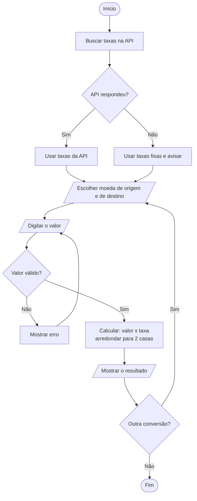
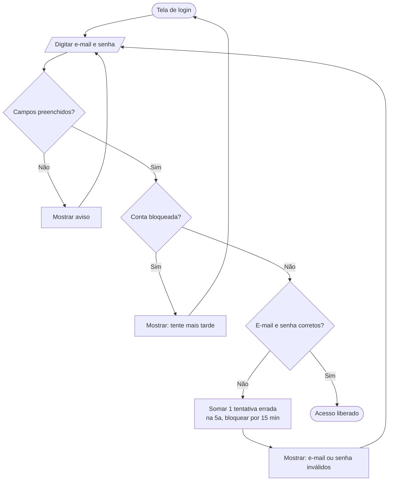

# Documentação técnica

Este documento tem duas partes: o **conversor de moedas** (desenvolvido nesta sprint) e a **funcionalidade de login**, que o enunciado também cita e que ficou documentada como proposta para uma próxima sprint.

---

## Parte 1: conversor de moedas

### 1.1 Descrição da funcionalidade

Programa em Python, usado pelo terminal, que converte valores entre Real (BRL), Dólar (USD) e Euro (EUR). O usuário escolhe as moedas, digita o valor e o programa mostra o resultado com duas casas decimais.

As taxas vêm da API Frankfurter. Se a API não responder, o programa usa taxas fixas de referência e avisa que o valor é aproximado.

Os cálculos usam `Decimal` em vez de `float`, porque o `float` tem erros de arredondamento. Por exemplo, `round(2.675, 2)` resulta em `2.67`, quando o certo é `2.68`.

### 1.2 Diagrama de fluxo



### 1.3 Interfaces necessárias

**Interface com o usuário (terminal):**

```text
=== Conversor de Moedas ===
Taxas usadas: API Frankfurter

  1) BRL - Real brasileiro
  2) USD - Dólar americano
  3) EUR - Euro
Moeda de origem: 2
Moeda de destino: BRL
Valor em USD: 100

100,00 USD = 518,88 BRL

Fazer outra conversão? (s/n): n
Até logo!
```

**Funções do programa (`conversor.py`):**

| Função | O que faz |
|--------|-----------|
| `buscar_taxas_api()` | Consulta a API e devolve as taxas em relação ao dólar |
| `obter_taxas()` | Usa a API ou, se der erro, as taxas fixas; informa a fonte |
| `ler_valor(texto)` | Converte o texto digitado em número e valida |
| `converter(valor, origem, destino, taxas)` | Calcula a conversão |
| `arredondar(valor)` | Arredonda para 2 casas, meio para cima |
| `formatar(valor, moeda)` | Mostra o valor no padrão brasileiro (`1.234,50 BRL`) |
| `main()` | Menu do programa |

### 1.4 Banco de dados e armazenamento

O conversor **não usa banco de dados**. As taxas buscadas na API ficam só na memória enquanto o programa está aberto. As taxas fixas de referência ficam no próprio código (`TAXAS_FIXAS`), com a cotação de 28/09/2026.

### 1.5 API externa

| Item | Valor |
|------|-------|
| Serviço | [API Frankfurter](https://frankfurter.dev/): gratuita e sem cadastro |
| Endereço | `https://api.frankfurter.dev/v2/rates?base=USD&quotes=BRL,EUR` |
| Tempo limite | 5 segundos |

Exemplo de resposta:

```json
[
  {"date": "2026-09-28", "base": "USD", "quote": "BRL", "rate": 5.1888},
  {"date": "2026-09-28", "base": "USD", "quote": "EUR", "rate": 0.87722}
]
```

Como as taxas estão em relação ao dólar, a conversão entre duas moedas usa: `taxa = taxa do destino / taxa da origem`. Exemplo: 50 EUR em BRL = 50 × (5,1888 / 0,87722) = 295,75.

---

## Parte 2: funcionalidade de login (proposta)

> Não foi implementada nesta sprint. É uma proposta para permitir, no futuro, que cada usuário salve seu histórico de conversões.

### 2.1 Descrição

O usuário entra com **e-mail e senha**. Se estiverem corretos, o sistema libera o acesso ao histórico de conversões. Se estiverem errados, mostra "E-mail ou senha inválidos" (sem dizer qual dos dois está errado, por segurança). Depois de 5 tentativas erradas, a conta fica bloqueada por 15 minutos.

### 2.2 Diagrama de fluxo



### 2.3 Interfaces necessárias

- **Tela de login:** campo de e-mail, campo de senha (com os caracteres escondidos), botão "Entrar" e área para mensagens de erro.
- **Funções previstas:** `cadastrar_usuario(email, senha)`, `fazer_login(email, senha)` e `sair()`.

### 2.4 Banco de dados

Um banco **SQLite** (já vem com o Python) com duas tabelas:

| Tabela | Colunas |
|--------|---------|
| `usuarios` | `id`, `email` (único), `senha_hash`, `tentativas_erradas`, `bloqueado_ate` |
| `historico` | `id`, `usuario_id`, `valor`, `moeda_origem`, `moeda_destino`, `resultado`, `data` |

A senha **nunca é guardada como texto**: é guardado só o *hash*, gerado com `hashlib.pbkdf2_hmac` (biblioteca padrão do Python).

### 2.5 APIs e serviços externos

Nenhum serviço externo é obrigatório para o login. Como melhoria futura, poderia existir um serviço de e-mail para recuperar a senha.
