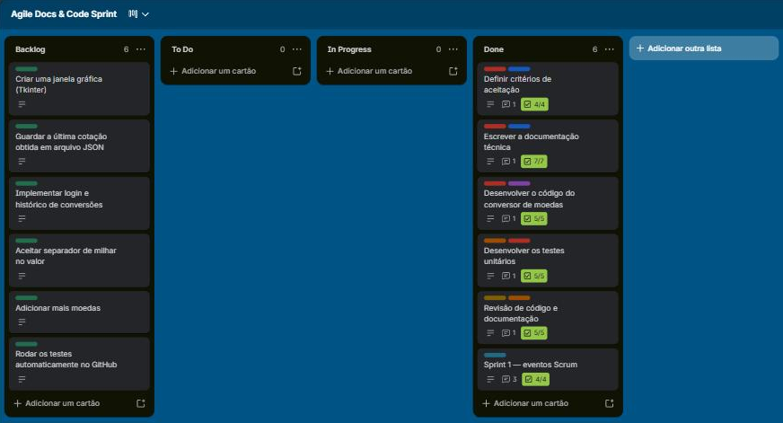

# Reflexão sobre o processo com Scrum

## Como organizei a sprint no Trello

Quadro: <https://trello.com/b/SsCVKm1Z/agile-docs-code-sprint>

| Lista | Papel no Scrum |
|-------|----------------|
| Backlog | Product Backlog: tarefas em ordem de prioridade |
| To Do | Sprint Backlog: tarefas escolhidas no planejamento da sprint |
| In Progress | Tarefa em andamento (uma de cada vez) |
| Done | Tarefas prontas, de acordo com a Definição de Pronto |

No **Sprint Planning**, coloquei as 5 tarefas em ordem de prioridade e estimei cada uma em pontos: critérios de aceitação (2), documentação técnica (3), código (5), testes (3) e revisão (2). Os critérios vieram primeiro porque eles definem o que é "pronto" e guiam o código e os testes. A revisão ficou por último porque depende de todo o resto.

Durante a sprint, movi cada cartão de **To Do** para **In Progress** e depois para **Done**, marcando a checklist de cada cartão. Como a atividade é individual, a **Daily** virou um comentário em cada cartão ao terminar a tarefa, dizendo o que foi feito e qual é o próximo passo.

## Sprint Review

Todas as 5 tarefas foram concluídas. O conversor funciona, os 20 testes passam e cobrem os 8 critérios de aceitação. As sugestões de melhoria da revisão foram adicionadas ao Backlog.

## Retrospectiva

- **O que funcionou:** escrever os critérios de aceitação antes do código ajudou muito, porque cada critério virou um ou mais testes. Fazer uma tarefa de cada vez deixou o quadro fácil de acompanhar.
- **O que pode melhorar:** um teste quebrou por um detalhe que só apareceu no final; rodar os testes com mais frequência durante o desenvolvimento teria mostrado isso antes.
- **Para a próxima sprint:** rodar os testes a cada mudança e atualizar a documentação junto com o código.

## Reflexão

O Scrum ajudou a dividir um trabalho grande em partes pequenas e a enxergar o progresso no quadro. O que mais me marcou foi a ligação entre os critérios de aceitação e os testes: com os critérios bem escritos, ficou claro o que testar e quando a tarefa estava pronta.

A principal limitação foi fazer tudo sozinho. O Scrum é pensado para um time, e eventos como a Daily e a Sprint Review perdem parte do sentido sem outras pessoas para dar opinião. Mesmo assim, seguir o processo deixou o trabalho mais organizado do que se eu tivesse começado direto pelo código.
